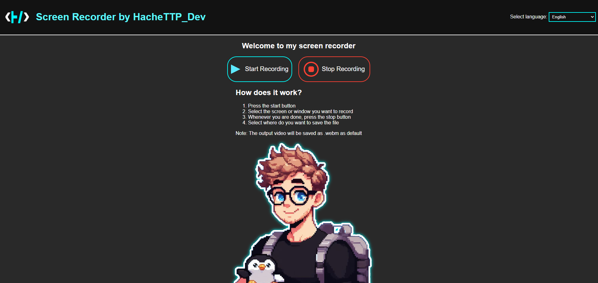

<h1 align="center">Hola 👋  soy Jorge Hernández Toledo ✨🐧 </h1>

  

 
<h2>Sobre mi 🐧</h2>
<!--Intro start-->

🎓 Técnico Superior en Desarrollo de Aplicaciones Web

🎨 Artista digital y tradicional por hobby. <i>Aunque a veces me dejo caer por algunos eventos</i>

💻 Especializado en la Experiencia de Usuario y en el diseño de las webs.

📩 Contacto: <strong>mailto:jorgeht2001@gmail.com</strong>
<!--Intro end-->
  

 

<h2 >Mis tecnologías y herramientas</h2>
<!--tech stack icons-->

  

 
<!-------------------------->

<h2 >Proyectos Destacados</h2>

<table align="left" >
<tr border="none">
  <td width="25%" align="center">
    

     <a href="https://youtu.be/rISmdhlhOPM" title="Go to Source">
       <h2> Screen-Recorder </h2>
        </a>
    
 
  </td>

<td width="25%" align="center">
    

     <a href="https://youtu.be/rISmdhlhOPM" title="Go to Source">
       <h2> Screen-Recorder </h2>
        </a>
    
 
  </td>

<td width="25%" align="center">
    

     <a href="https://youtu.be/rISmdhlhOPM" title="Go to Source">
       <h2> Screen-Recorder </h2>
        </a>
    
 
  </td>
  
</tr>
</table>
  

<!-------------------------->

<h2>GitHub :octocat:</h2>
<!--- stats & Trophy (start) -->

  <!--- stats (start) -->
<table align="left">
<tr border="none">
<td width="60%" align="center">

<!--  
     -->
   
</td>

<td width="40%" align="center">

  

  </td>
</tr>
</table>
<!--- stats (end) -->

<!--- trophy (start) -->

  

<!--- trophy (start) -->

     

   
<!--- stats (end) -->
