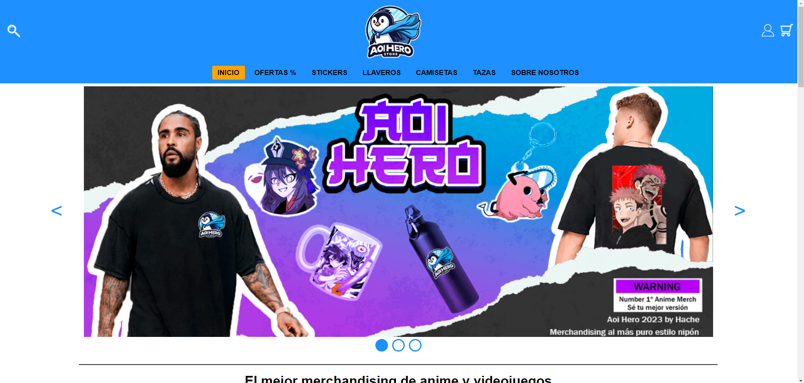
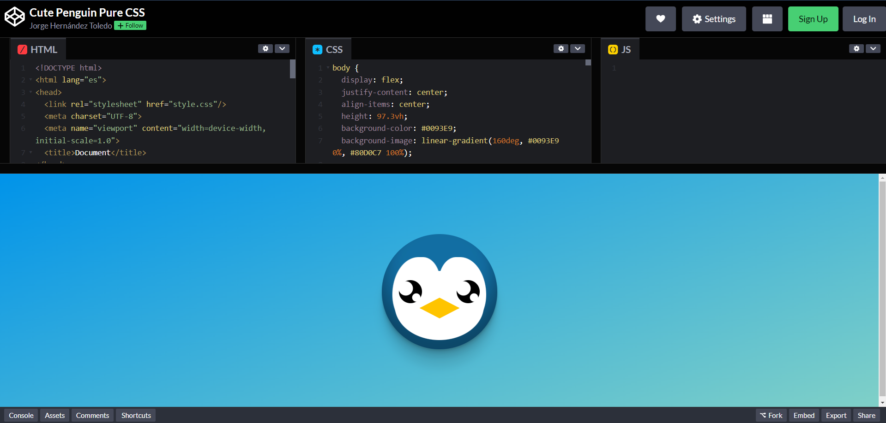

  <h1 align="center">Hola 👋  soy Jorge Hernández / Hache ✨🐧 </h1> 
  

  

 
<h2>Sobre mi 🐧</h2>
<!--Intro start-->

🎓 Técnico Superior en Desarrollo de Aplicaciones Web

🎨 Artista digital y tradicional por hobby. <i>Aunque a veces me dejo caer por algunos eventos</i>

💻 Especializado en la Experiencia de Usuario y en el diseño de las webs.

📩 Contacto: <strong>mailto:jorgeht2001@gmail.com</strong>
<!--Intro end-->
  

 

<h2 >Mis tecnologías y herramientas</h2>
<!--tech stack icons-->

  

 
<!-------------------------->

  <h2>Proyectos Destacados</h2>

  <table align="left" border="none">
    <tr>
      <td width="25%" align="center">
        <a href="https://jorgehdezt.github.io/Screen-Recorder/">
          <h2 align="center">Screen-Recorder</h2>
          
        </a>
      </td>
       <td width="25%" align="center">
        <a href="https://jorgehdezt.github.io/Screen-Recorder/">
          <h2 align="center">Aoi Hero</h2>
          
        </a>
      </td>
       <td width="25%" align="center">
        <a href="https://codepen.io/Jorge-Hern-ndez-Toledo/pen/qBLPvLe">
          <h2 align="center">CSS Penguin</h2>
          
        </a>
      </td>
    </tr>
  </table>

<!-------------------------->

<h2>GitHub :octocat:</h2>
<!--- stats & Trophy (start) -->

  <!--- stats (start) -->
<table align="left">
<tr border="none">
<td width="60%" align="center">

<!--  
     -->
   
</td>

<td width="40%" align="center">

  

  </td>
</tr>
</table>
<!--- stats (end) -->

<!--- trophy (start) -->

  

<!--- trophy (start) -->

     

   
<!--- stats (end) -->
